# AutoRisk Subro


## Table of Contents

- [Goals](#goals)
- [Project Overview](#project-overview)
- [Repository Layout](#repository-layout)
- [Part 1: Environment Setup](#part-1-environment-setup)
- [Part 2: Data Ingestion, Storage and Processing](#part-2-data-ingestion-storage-and-processing)
- [Part 3: Getting Started](#part-3-getting-started)
- [Part 4: Analysis Results](#part-4-analysis-results)
- [Part 5: Machine Learning Pipeline](#part-5-machine-learning-pipeline)
- [Part 6: Testing](#part-6-testing)
- [Part 7: CI/CD Workflows](#part-7-cicd-workflows)
- [Part 8: Web App 1.0](#part-8-web-app-10)
- [Part 9: Apache Airflow ML Pipeline](#part-9-apache-airflow-ml-pipeline)
- [Part 10: Refactoring](#part-10-refactoring)
- [Part 11: Data Engineering Principles](#part-11-data-engineering-principles)
  

---

## Goals

- Identify opportunity of subrogation in first-party physical damage claims.
- Understand key indicators of subrogation opportunity.
- Provide a recommendation on how this information could be leveraged at TriGuard Insurance Company.

---

## Project Overview

This README provides a comprehensive end-to-end guide for the **TriGuard Insurance Subrogation Prediction System**, covering infrastructure setup, data engineering, exploratory analysis, machine learning pipeline development, testing, CI/CD automation, and production deployment.

### Documentation Structure

- **Part 1: Environment Setup** - Reproducible development environment using VS Code Dev Containers, Docker, Python, and AWS RDS PostgreSQL connection.

- **Part 2: Data Ingestion, Storage and Processing** - Data normalization process, cloud deployment on AWS Lightsail, and relational schema design (5-table star schema).

- **Part 3: Getting Started** - Practical connection details for Jupyter notebooks and DBeaver, with workflow examples for database queries.

- **Part 4: Analysis Results** - Comprehensive SQL and statistical analysis across accident, claim, driver, vehicle, and policyholder dimensions. Includes Polars-based regression analysis and interactive Tableau dashboards.

- **Part 5: Machine Learning Pipeline** - Complete ML pipeline with advanced feature engineering (300+ features), SMOTE for class imbalance, Optuna hyperparameter optimization, and F1-weighted ensemble models (LightGBM, XGBoost, CatBoost).

- **Part 6: Testing** - Comprehensive test suite using Pytest with unit tests, integration tests, fixtures, and coverage reporting. Includes test markers for selective execution (fast/slow, unit/integration).

- **Part 7: CI/CD Workflows** - Automated GitHub Actions workflows for continuous integration (multi-version Python testing), code quality checks (linting, formatting, complexity), security scans, and scheduled test runs.

- **Part 8: Web App 1.0** - Production-ready web application deployed on Netlify for subrogation triage and prediction.

- **Part 9: Apache Airflow ML Pipeline** - Production-grade orchestration using Apache Airflow in Docker, with automated DAG execution, artifact management, and scheduled model retraining.

---

## Repository Layout

```
.
├─ .devcontainer/              # Docker & Airflow configuration
│  ├─ docker-compose.yml       # Airflow services (webserver, scheduler, db, redis)
│  ├─ .Dockerfile             # Custom Airflow image with ML dependencies
│  ├─ devcontainer.json       # VS Code Dev Container config
│  ├─ .env                    # Environment variables (not committed)
│  └─ db.env                  # PostgreSQL config for Airflow metadata
│
├─ .github/
│  ├─ workflows/              # CI/CD workflows
│  │  ├─ ci.yml              # Main CI pipeline (test, lint, security)
│  │  ├─ code-quality.yml    # Code quality checks
│  │  └─ test-on-schedule.yml # Scheduled comprehensive tests
│  └─ WORKFLOWS.md           # CI/CD documentation
│
├─ airflow/                   # Apache Airflow orchestration
│  ├─ dags/
│  │  └─ triguard_ml_pipeline.py  # Self-contained ML DAG (926 lines)
│  ├─ logs/                  # Task execution logs
│  ├─ artifacts/             # Model outputs and predictions
│  ├─ config/                # Airflow configuration
│  └─ plugins/               # Custom Airflow plugins
│
├─ analysis/                  # SQL & statistical analysis
│  ├─ tina_accident/         # Accident analysis (SQL + Polars regression)
│  ├─ lingyue_vehicle/       # Vehicle analysis (SQL + stats)
│  ├─ bruce_driver/          # Driver analysis (SQL + logistic regression)
│  ├─ brynn_policyholder/    # Policyholder analysis (SQL)
│  └─ tableau/               # Interactive dashboards (PNG exports)
│
├─ data/                      # Data files and artifacts
│  ├─ tri_guard_5_py_clean/  # Normalized CSV files (5 tables)
│  │  ├─ Accident.csv
│  │  ├─ Claim.csv
│  │  ├─ Driver.csv
│  │  ├─ Policyholder.csv
│  │  └─ Vehicle.csv
│  ├─ Training_TriGuard.csv  # Original raw data
│  ├─ submission.csv         # Model predictions output
│  ├─ TriGuard_ERD_pretty.png # Entity relationship diagram
│  └─ AWS.png                # AWS infrastructure diagram
│
├─ notebooks/                 # Jupyter notebooks
│  ├─ data_inspection.ipynb  # Data validation notebook
│  ├─ load_staging_data.ipynb # Database loading
│  ├─ connect_and_test.ipynb # Database connection tests
│  ├─ modeling.ipynb         # ML development notebook
│  └─ modeling.html          # Exported notebook for reference
│
├─ scripts/                   # Production Python scripts
│  ├─ modeling.py            # Complete ML pipeline (833 lines)
│  └─ split_triguard_5tables.py # Data normalization script
│
├─ subro-app/                 # Web application
│  ├─ index.html             # Home page
│  ├─ triage.html            # Triage tool
│  ├─ app.js                 # Application logic
│  ├─ styles.css             # Styling
│  └─ screenshots/           # App screenshots
│
├─ tests/                     # Comprehensive test suite
│  ├─ conftest.py            # Pytest fixtures
│  ├─ test_modeling.py       # ML pipeline tests
│  ├─ test_data_utils.py     # Data utility tests
│  ├─ test_analysis_scripts.py # Analysis script tests
│  ├─ test_system_pipeline.py # Integration tests
│  ├─ test_images.py         # Image validation tests
│  └─ README.md              # Test documentation
│
├─ requirements.txt           # Python dependencies
├─ pytest.ini                # Pytest configuration
├─ Makefile                  # Build automation (test, lint, format)
├─ .env.example              # Template for environment variables
├─ AIRFLOW_SETUP.md          # Airflow setup documentation
└─ README.md                 # This file (2000+ lines)
```

**Key Directories:**
- `.devcontainer/` - Dockerized development environment + Airflow orchestration
- `airflow/` - Production ML pipeline orchestrated with Apache Airflow
- `analysis/` - SQL queries, statistical analysis, and visualizations
- `scripts/` - Production-ready Python modules
- `tests/` - Comprehensive test suite with >80% coverage goal
- `subro-app/` - Deployed web application (Netlify)

---

## Part 1: Environment Setup

This guide walks through setting up the **complete development and production environment**, which includes Apache Airflow orchestration, PostgreSQL databases (local metadata + AWS RDS), and all ML dependencies.

**TL;DR:** Fill `.devcontainer/.env` with AWS RDS credentials, run `docker-compose up -d` from the `.devcontainer/` directory. Access Airflow UI at `localhost:8080` (admin/admin).

### Architecture Overview

The environment consists of:
- **Apache Airflow** - ML pipeline orchestration (webserver, scheduler, triggerer)
- **PostgreSQL (local)** - Airflow metadata database (`triguard_db`)
- **PostgreSQL (AWS RDS)** - Production data warehouse (claims data)
- **Redis** - Celery message broker
- **Custom Docker Image** - Python 3.12 + ML libraries (LightGBM, XGBoost, CatBoost, etc.)

### Configuration Files

#### 1. `.devcontainer/.Dockerfile`

Custom Airflow image with ML dependencies:

```dockerfile
# Start from the official Airflow image
FROM apache/airflow:3.0.3

# Switch to root user to install system-level packages
USER root

# Install system dependencies
RUN apt-get update \
    && apt-get install -y --no-install-recommends \
       postgresql-client \
       libgomp1 \
    && rm -rf /var/lib/apt/lists/*

# Back to non-root airflow user
USER airflow

# Install Python dependencies
COPY --chown=airflow:root requirements.txt .
RUN pip install --no-cache-dir -r requirements.txt
```

**Key components:**
- `apache/airflow:3.0.3` - Stable Airflow base image (compatible with SQLAlchemy 1.4.x)
- `postgresql-client` - For database connections and debugging
- `libgomp1` - GNU OpenMP library required by ML packages (XGBoost, LightGBM)
- ML dependencies installed from `requirements.txt`

#### 2. `.devcontainer/docker-compose.yml`

Multi-service orchestration (excerpt):

```yaml
x-airflow-common: &airflow-common
  build:
    context: ..
    dockerfile: .devcontainer/.Dockerfile

  environment: &airflow-common-env
    AIRFLOW__CORE__EXECUTOR: CeleryExecutor
    AIRFLOW__DATABASE__SQL_ALCHEMY_CONN: postgresql+psycopg2://vscode:vscode@db:5432/triguard_db?sslmode=disable
    AIRFLOW__CELERY__RESULT_BACKEND: db+postgresql://vscode:vscode@db:5432/triguard_db?sslmode=disable
    AIRFLOW__CELERY__BROKER_URL: redis://:@redis:6379/0
    AIRFLOW__CORE__LOAD_EXAMPLES: 'false'
    
    # AWS RDS connection (from .env)
    PGHOST: ${PGHOST}
    PGPORT: ${PGPORT:-5432}
    PGDATABASE: ${PGDATABASE}
    PGUSER: ${PGUSER}
    PGPASSWORD: ${PGPASSWORD}
    PGSSLMODE: ${PGSSLMODE:-require}

  volumes:
    - ../airflow/dags:/opt/airflow/dags
    - ../airflow/logs:/opt/airflow/logs
    - ../airflow/artifacts:/opt/airflow/artifacts
    - ../data:/opt/airflow/data
    - ../scripts:/opt/airflow/scripts

services:
  db:                    # Local PostgreSQL for Airflow metadata
  redis:                 # Celery message broker
  airflow-apiserver:     # Airflow webserver (port 8080)
  airflow-scheduler:     # Task scheduler
  airflow-triggerer:     # Deferred task handler
  airflow-init:          # One-time database initialization
```

**Services:**
- `db` - PostgreSQL 16 on port 5433 (avoids conflict with RDS)
- `redis` - Redis for Celery task queue
- `airflow-apiserver` - Web UI and API (localhost:8080)
- `airflow-scheduler` - Schedules and monitors DAGs
- `airflow-triggerer` - Handles async/deferred tasks
- `airflow-init` - Initializes Airflow database on first run

#### 3. `.devcontainer/.env`

Environment variables (create from template, **do not commit**):

```bash
# Airflow user ID (use your local UID)
AIRFLOW_UID=501

# AWS RDS PostgreSQL connection
PGHOST=your-rds-endpoint.amazonaws.com
PGPORT=5432
PGDATABASE=jet2_holiday
PGUSER=dbmasteruser
PGPASSWORD=your-secure-password
PGSSLMODE=require
```

**Get your AIRFLOW_UID:**
```bash
# macOS/Linux
id -u

# Output: 501 (or similar, use this value)
```

#### 4. `.devcontainer/db.env`

PostgreSQL config for local Airflow metadata database:

```bash
POSTGRES_DB=triguard_db
POSTGRES_USER=vscode
POSTGRES_PASSWORD=vscode
```

**Note:** This is the **local** database for Airflow's internal metadata, separate from your AWS RDS data warehouse.

### Python Dependencies

The `requirements.txt` includes comprehensive ML and data science packages:

**Core ML Libraries:**
```
scikit-learn>=1.3.0
xgboost>=2.0.0
lightgbm>=4.3.0
catboost>=1.2.0
optuna>=3.0.0          # Hyperparameter optimization
imbalanced-learn>=0.12.0  # SMOTE for class imbalance
shap>=0.44.0           # Model interpretability
```

**Data Processing:**
```
pandas>=2.0.0
polars>=0.19.0         # High-performance DataFrame library
numpy>=1.26.0
pyarrow>=16.0          # Parquet file support
statsmodels>=0.14.0
```

**Database & Orchestration:**
```
SQLAlchemy>=1.4.49,<2.0  # Database ORM (Airflow 3.0.3 compatible)
psycopg2-binary>=2.9     # PostgreSQL driver
apache-airflow-providers-postgres>=6.2.1
python-dotenv>=1.0
```

**Testing:**
```
pytest>=7.4.0
pytest-cov>=4.1.0      # Coverage reporting
pytest-mock>=3.11.0
pytest-xdist>=3.3.0    # Parallel test execution
```

**Total:** 29 packages + dependencies (~2GB installed)

### Setup Instructions

#### Step 1: Clone and Configure

```bash
# Clone repository
git clone <repository-url>
cd 706_final_project

# Create .env file from template
cp .env.example .devcontainer/.env

# Edit with your credentials
nano .devcontainer/.env
```

#### Step 2: Build and Start Services

```bash
# Navigate to devcontainer directory
cd .devcontainer

# Build custom Airflow image (first time only, ~5-10 minutes)
docker-compose build --no-cache

# Start all services
docker-compose up -d

# Check service health
docker-compose ps
```

**Expected output:**
```
NAME                    STATUS
airflow-apiserver-1     Up (healthy)
airflow-scheduler-1     Up (healthy)
airflow-triggerer-1     Up (healthy)
db-1                    Up (healthy)
redis-1                 Up (healthy)
```

#### Step 3: Access Airflow UI

1. Open browser: `http://localhost:8080`
2. Login:
   - **Username:** `admin`
   - **Password:** `admin`
3. Navigate to **DAGs** → `triguard_ml_training_pipeline`

#### Step 4: Verify Connections

**Test local Airflow metadata DB:**
```bash
docker-compose exec db psql -U vscode -d triguard_db -c "SELECT 1;"
```

**Test AWS RDS connection from container:**
```bash
docker-compose exec airflow-apiserver psql -h $PGHOST -U $PGUSER -d $PGDATABASE -c "SELECT current_database();"
```

### Common Issues & Solutions

#### Issue: Port 8080 already in use
**Solution:**
```bash
# Check what's using port 8080
lsof -i :8080

# Stop conflicting service or change Airflow port in docker-compose.yml
# ports: - "8081:8080"  # Use 8081 instead
```

#### Issue: `airflow-init` stuck or failing
**Solution:**
```bash
# Check logs
docker-compose logs airflow-init

# Common fixes:
# 1. Ensure .env file exists and has correct AIRFLOW_UID
# 2. Clean volumes and rebuild
docker-compose down -v
docker-compose up -d
```

#### Issue: DAG not appearing in UI
**Solution:**
```bash
# Check DAG syntax
python airflow/dags/triguard_ml_pipeline.py

# Check scheduler logs
docker-compose logs -f airflow-scheduler

# DAGs are scanned every 30 seconds, wait briefly
```

#### Issue: Permission denied errors
**Solution:**
```bash
# Fix ownership of Airflow directories
chmod -R 755 airflow/dags airflow/logs airflow/artifacts

# Ensure AIRFLOW_UID matches your user ID
echo "AIRFLOW_UID=$(id -u)" >> .devcontainer/.env
docker-compose down
docker-compose up -d
```

### Development Workflow

**For VS Code users:**

1. Install the **Docker** and **Remote - Containers** extensions
2. Open project in VS Code
3. Click the green corner button → **Reopen in Container**
4. VS Code connects to the `airflow-apiserver` container
5. Use integrated terminal for commands

**For terminal users:**

```bash
# Exec into Airflow container
docker-compose exec airflow-apiserver bash

# Run Python scripts
python scripts/modeling.py

# Test DAG
airflow dags test triguard_ml_training_pipeline 2025-01-01
```

### Stopping the Environment

```bash
# Stop all services (preserves data)
docker-compose stop

# Stop and remove containers (preserves volumes)
docker-compose down

# Nuclear option: remove everything including data
docker-compose down -v
```

### Next Steps

✅ Environment is ready! Proceed to:
- **Part 3** - Connect to AWS RDS and query data
- **Part 9** - Run the Airflow ML pipeline

---

## Part 2: Data Ingestion, Storage and Processing

### Cloud Storage and Deployment (AWS Lightsail)

To ensure persistent data access and enable team collaboration, all cleaned tables (`Claim`, `Vehicle`, `Driver`, `Policyholder`, and `Accident`) were uploaded to an AWS Lightsail instance. AWS Lightsail provides a simplified cloud infrastructure with built-in SSH access and managed PostgreSQL database capabilities, making it suitable for lightweight data warehousing and remote querying. The Lightsail instance hosts a PostgreSQL container that mirrors our local schema (`stg`), allowing real-time querying and integration with analysis scripts in the `analysis/` folder.  

This setup ensures:
- Secure and persistent cloud storage  
- Seamless remote access for team members

<p align="center">
  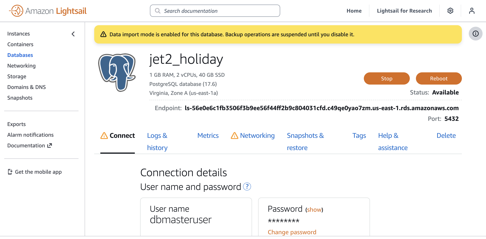
</p>

### Data Storage and Schema Design

To improve data consistency and enable efficient subrogation analysis, the original wide Training_TriGuard.csv dataset was normalized into five relational tables: Claim, Vehicle, Driver, Policyholder, and Accident. This decomposition follows a star schema, where Claim acts as the central fact table, linking to four dimension tables through foreign keys. The process was completed using Python (pandas) by extracting unique keys and attributes for each entity and ensuring referential integrity between tables.

| Table            | Description                                                                                                     | Primary Key        | Key Columns / Notes                                                                                   |
| ---------------- | --------------------------------------------------------------------------------------------------------------- | ------------------ | ----------------------------------------------------------------------------------------------------- |
| **Claim**        | Central fact table containing subrogation indicators, payout estimates, liability percentage, and related keys. | `claim_number`     | Links to all four dimension tables (`accident_key`, `policyholder_key`, `vehicle_key`, `driver_key`). |
| **Vehicle**      | Stores information about the insured vehicle such as make year, price, weight, and mileage.                     | `vehicle_key`      | Linked to Claim via `vehicle_key`.                                                                    |
| **Driver**       | Contains driver attributes like age, gender, license years, and driving state.                                  | `driver_key`       | Linked to Claim via `driver_key`.                                                                     |
| **Policyholder** | Includes policyholder-level data such as policy state, tenure months, and prior claims count.                   | `policyholder_key` | Linked to Claim via `policyholder_key`.                                                               |
| **Accident**     | Records accident-related information including location, date, weather, and severity.                           | `accident_key`     | Linked to Claim via `accident_key`.                                                                   |

Each table has been exported as a CSV file and loaded into the PostgreSQL stg schema.

### Entity Relationship Diagram (ERD)

The logical schema of the TriGuard Subrogation dataset is illustrated below:

<p align="center">
  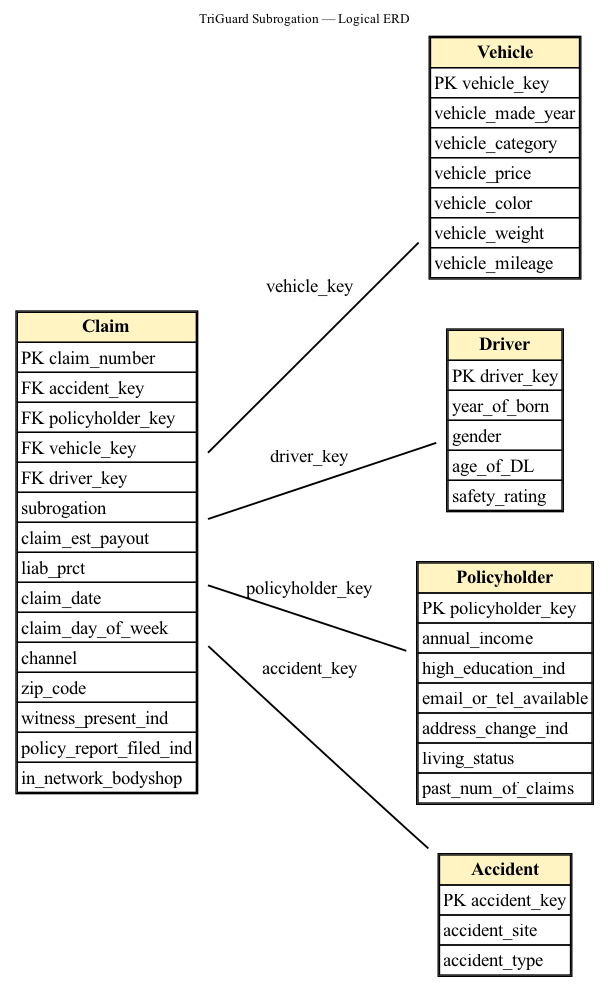
</p>

### Current Database State

The entire "bootstrap" and "normalization" process described below has been completed by Mingjie.

- The `stg` (Staging) and `mart` (Data Mart) schemas **have been created**.
- The five normalized tables (`claim`, `accident`, etc.) **have been loaded** into the `stg` schema.

Team members **do not** need to run any bootstrap or data loading scripts. The data is ready for use.

The following sections simply document how this state was achieved.

### Workstream Objective

This section outlines the **data normalization and validation phase** of the project. The objective of this workstream was to refactor the original `Training_TriGuard.csv` dataset from a single, wide-format table into a relational database schema.

This foundational step is critical, as it improves data integrity, reduces data redundancy, and optimizes the dataset for subsequent analysis.

### Transformation Process

- **Original Source:** `Training_TriGuard.csv` (A single, denormalized table).
- **Transformation Script:** `split_triguard_5tables.py`
- **Action:** This script processes the original CSV and splits its columns into five logically distinct tables, linked by foreign keys.

### Normalized Output Tables

The transformation resulted in the following five CSV files (which are now tables in `stg`):

1. `claim` - The main fact table with foreign keys.
2. `accident` - Dimension table with accident details.
3. `policyholder` - Dimension table with policyholder information.
4. `vehicle` - Dimension table with vehicle-specific data.
5. `driver` - Dimension table with driver information.

### Validation and Integrity Check

To confirm that the splitting process was accurate, a "sanity check" was performed using the `data_inspection.ipynb` notebook.

**Validation Process:**

1. **Load Data:** Loads the five new CSVs (`Claim.csv`, etc.) into pandas DataFrames.
2. **Load Original:** Loads the original `Training_TriGuard.csv` for comparison.
3. **Prepare Keys:** Converts the foreign key columns (`accident_key`, etc.) in the `df_claim` table to `int64` to ensure type compatibility for merging.
4. **Reconstruct Table:** Performs a series of `left-merge` operations, starting with the `df_claim` and joining the other four tables.
5. **Verify:** Compares the reconstructed, merged DataFrame against the original using `pd.testing.assert_frame_equal`.

**Result:** The test passed, confirming the normalization was successful, accurate, and lossless before the data was loaded.

---

## Part 3: Getting Started

After completing Part 1 (launching the Dev Container), the database is ready to be queried.

### Connect from Jupyter / Python

This snippet can be used in a notebook (e.g., `notebooks/connect_and_test.ipynb`):

```python
import os
import pandas as pd
from sqlalchemy import create_engine, text

PGHOST = os.getenv("PGHOST")
PGPORT = os.getenv("PGPORT", "5432")
PGDB   = os.getenv("PGDATABASE")
PGUSER = os.getenv("PGUSER")
PGPASS = os.getenv("PGPASSWORD")
PGSSL  = os.getenv("PGSSLMODE", "require")

engine = create_engine(
    f"postgresql+psycopg2://{PGUSER}:{PGPASS}@{PGHOST}:{PGPORT}/{PGDB}"
    + (f"?sslmode={PGSSL}" if PGSSL else "")
)

with engine.begin() as con:
    print("Connection successful.")
    print("search_path =", con.execute(text("show search_path")).scalar())
    print("who/where   =", con.execute(text("select current_database(), current_user")).fetchone())

# Test by reading from the 'stg.claim' table, which is already loaded
print("\nVerifying data in stg.claim...")
df_check = pd.read_sql("SELECT * FROM stg.claim LIMIT 5", engine)
display(df_check)
```

### Connect from DBeaver (Local Desktop)

1. New Connection → PostgreSQL
2. Main tab:
    - Host: `ls-56e0e6c1fb3506f3b9ee56f44ff2b9c804031cfd.c49qe0yao7zm.us-east-1.rds.amazonaws.com`
    - Port: `5432`
    - Database: `jet2_holiday`
    - Username: `dbmasteruser`
    - Password: `jet2_holiday`
3. SSL tab:
    - Mode: `require`
4. Test Connection → Finish.

### Common Issues

- **Auth/timeout:** Ensure the RDS security group allows the current client IP address on port 5432.
- **SSL errors:** Keep `sslmode=require` in all connections.
- **Notebook cannot connect:** Confirm the container has the env vars (`echo $PGHOST`) and that psql works from the VS Code terminal.

---

## Part 4: Analysis Results

### 4.1 Accident and Claim Analysis

This section documents the key findings from the SQL analysis performed on the `accident` and `claim` datasets to identify subrogation opportunities.

SQL queries are in `analysis/tina_accident/accident_claim.sql`.

#### Query 1: Basic Statistics


- Total accidents: 12
- Unique accident sites: 4
- Unique accident types: 3

#### Query 2: Detailed Accident Records

The dataset contains 12 accidents with the following distribution:
- Accident sites: Parking Area, Unknown, Highway/Intersection, Local
- Accident types: multi_vehicle_clear, multi_vehicle_unclear, single_car
- Accident keys range from 1 to 12

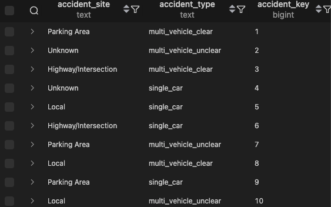
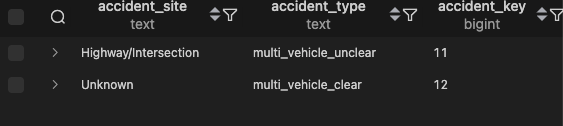

#### Query 3: Accident Type Distribution

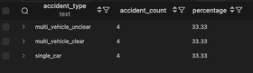

The dataset is evenly distributed across three accident types, with multi-vehicle accidents (both clear and unclear) representing 66.67% of all accidents.

#### Query 4: Accident Site Distribution

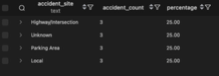

Accidents are evenly distributed across all four site types (25% each).

#### Query 5: Multi-Vehicle Accident Analysis

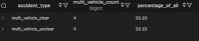

8 out of 12 accidents (66.67%) are multi-vehicle incidents, indicating significant subrogation potential across the dataset.

#### Query 6: Accident-Site-Type Combinations

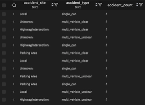

The analysis shows all 12 unique combinations of accident sites and types, with each combination appearing exactly once. This suggests a well-distributed sample dataset covering various scenarios.

#### Query 7: Comprehensive Accident-Claim Join

Successfully joined accident characteristics with claim indicators including:
- Witness presence (Y/N)
- Policy report filed (0/1)
- In-network bodyshop usage (yes/no)

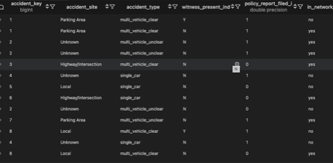

#### Query 8: High Subrogation Potential Claims

This query identifies claims with the highest subrogation potential (multi-vehicle + witnesses + police report).

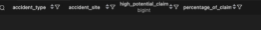

Query 8 returned no results, indicating that none of the multi-vehicle accidents in this dataset have both a witness present and a police report filed. This suggests limited high-priority subrogation opportunities in the current dataset.

#### Query 9: Accident Type Subrogation Indicators

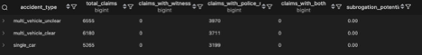

No claims in the dataset have witnesses present, which severely limits subrogation potential. While police reports are filed for 60-65% of multi-vehicle claims, the absence of witnesses reduces the strength of potential subrogation cases.

#### Query 10: Accident Site Subrogation Indicators


Across all accident sites, approximately 60% of claims have police reports filed, but again, the absence of witnesses across all locations limits subrogation effectiveness.

#### Query 11: Comprehensive Subrogation Priority View

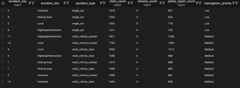

The analysis categorized accidents into subrogation priority levels:
- **Low Priority:** Single-car accidents (accidents 4, 5, 6, 9)
- **Medium Priority:** Multi-vehicle accidents without both witnesses and police reports (accidents 1, 2, 3, 7, 8, 10, 11, 12)
- **High Priority:** None identified (would require multi-vehicle + witness + police report)

#### Key Insights and Recommendations

1. Despite 66.67% of accidents being multi-vehicle incidents, the absence of witness documentation means no claims achieve "high priority" subrogation status.

2. 60-65% of claims have police reports filed, which is a positive indicator but insufficient alone for strong subrogation cases.

3. Multi-Vehicle Accident Distribution:
   - multi_vehicle_clear: 6,190 claims (34.4%)
   - multi_vehicle_unclear: 6,555 claims (36.4%)
   - Combined multi-vehicle total: 12,745 claims (70.8% of all claims)

**Recommended actions for the company:**

1. Implement processes to ensure witness information is captured at the scene. This is the single most critical gap in the current data.

2. With over 70% of claims involving multiple vehicles, these represent the largest pool for potential subrogation, if witness and documentation gaps can be addressed.

3. The 6,190 "multi_vehicle_clear" claims with police reports (3,711) should be the first target for subrogation investigation, as fault determination is clearer.

4. Investigation Priority:
   - First: Multi-vehicle accidents at Highway/Intersection with police reports
   - Second: Multi-vehicle accidents at Unknown/Parking Area with police reports
   - Third: All other multi-vehicle accidents

5. Data Quality: The "Unknown" accident site category (4,310 claims, 23.9%) should be minimized through better initial claims documentation.

---

### 4.2 Polars-Based Regression Analysis on Claim Payouts

This section documents regression modeling performed using Polars to predict `claim_est_payout` and identify key cost drivers.

**Analysis Script:** `analysis/tina_accident/polar.py`

#### Model Overview

- **Target Variable:** claim_est_payout
- **Model Type:** Linear Regression (OLS)
- **Features:** 9 variables including binary indicators, liability percentage, and encoded categorical variables
- **Data Processing:** Missing values removed, categorical variables label-encoded

#### Model Performance

- **R² Score:** -0.0013 (negative, indicating model performs worse than baseline)
- **MSE:** 13248383
- **RMSE:** ~$3640 (square root of MSE)
- **Sample Size:** 17999 claims

#### Feature Importance (Ranked by Absolute Coefficient)

| Rank | Feature | Coefficient | Impact |
|------|---------|-------------|--------|
| 1 | Police Report Filed | +$110.53 | Claims with police reports have ~$111 higher payouts |
| 2 | Subrogation Flag | -$55.50 | Subrogation cases have ~$55 lower payouts (cost recovery) |
| 3 | Multi-vehicle Accident | +$43.93 | Multi-vehicle incidents increase payouts by ~$44 |
| 4 | Accident Type | +$31.43 | Different accident types have varying cost impacts |
| 5 | Channel | -$27.62 | Claim submission channel affects payout amounts |
| 6 | Accident Site | +$7.96 | Location has minor impact on costs |
| 7 | Liability Percentage | +$5.01 | Higher liability slightly increases payout |
| 8 | Witness Present | ~$0 | No measurable impact on payout amounts |
| 9 | In-network Bodyshop | ~$0 | No measurable impact on payout amounts |

**Base Intercept:** $3297 (baseline payout when all features are zero/reference category)

#### Key Findings

1. **No Predictive Power:** The negative R² (-0.0013) indicates that this feature set cannot predict claim payout amounts—the model performs worse than simply predicting the mean payout for all claims. Claim amounts are driven primarily by factors not captured in this dataset, such as:
   - Actual damage severity
   - Medical costs and injuries
   - Vehicle repair complexity
   - Vehicle market value
   - Parts and labor costs

2. **Documentation Impact:** Police reports are the strongest predictor among available features (+$110), suggesting documented claims may involve more severe incidents or justify higher payouts.

3. **Subrogation Effect:** The negative coefficient for subrogation (-$55) indicates the company successfully recovers costs on flagged claims, reducing net payout amounts.

4. **Witness Paradox:** Despite witnesses being critical for subrogation success (per SQL analysis), they do not affect payout amounts—confirming their value lies in recovery potential, not cost prediction.

#### Comparison with Prior Analyses

This regression complements the SQL-based subrogation analysis:
- **SQL Analysis:** Identified documentation (witness + police report) as key for subrogation opportunity
- **Regression Analysis:** Shows documentation affects payout amounts but explains essentially zero variance
- **Combined Insight:** High-payout claims with strong documentation (police report + witness) represent the best subrogation targets

#### Limitations

- Current features explain 0% of payout variance (negative R²)
- Missing critical predictors: damage severity, injury indicators, vehicle value, repair costs
- Model is not suitable for production use without additional features

#### Next Steps

1. Collect damage severity indicators (e.g., airbag deployment, towing required, total loss indicator)
2. Include vehicle value and actual repair cost estimates
3. Add injury/medical claim flags
4. Test non-linear models (Random Forest, XGBoost) for better predictions
5. Integrate high-payout claims with strong documentation into subrogation priority queue (Query 9 criteria)

#### Files Generated

- `result12_regression_metrics.csv` - Model performance metrics and coefficients
- `result13_feature_importance.csv` - Feature ranking by absolute coefficient value

---

### 4.3 Claim and Vehicle Analysis

#### Query 1: By Vehicle Category & Color

**Purpose:** Compare vehicle category and color against subrogation likelihood, payout behavior, and claim-to-value ratio.

**Findings:**

- Highest subrogation rate: Compact / silver (0.2737) — followed by black (0.2525) and red (0.2409).
- Compact cars overall subrogate more frequently than Large or Medium vehicles.
- Subrogated claims tend to have slightly higher average payouts (e.g., Compact/silver ≈ $3,801 vs. $3,634 non-subro).
- Claim-to-value ratio remains around 0.16–0.17, suggesting consistent proportional payout levels.

<p align="center">
  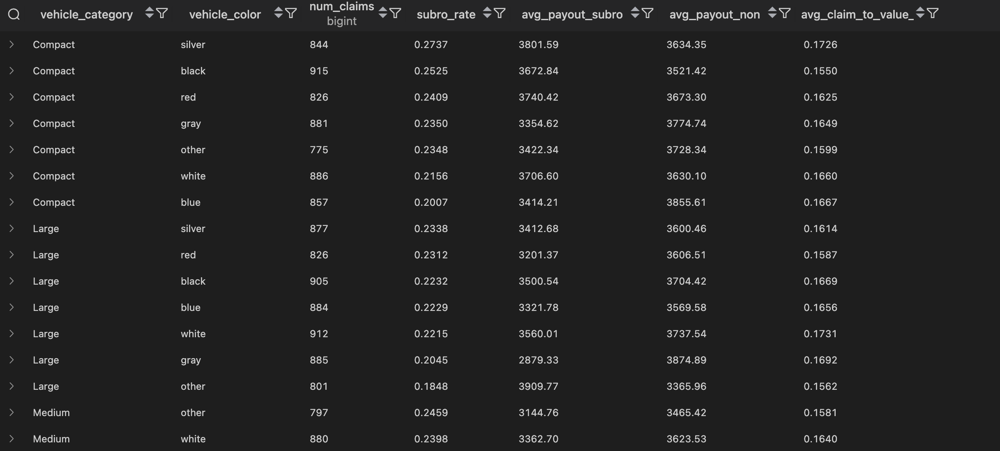
  <br>
  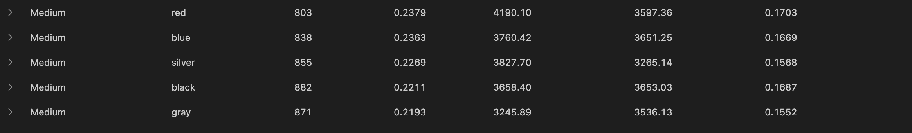
</p>

#### Query 2: By Vehicle Price Band

**Purpose:** Analyze whether higher-value vehicles are more likely to be subrogated and how payout ratios change by price.

**Findings:**

- Subrogation rate rises slightly with vehicle value.
- Claim-to-value ratio decreases as price increases — expensive cars yield smaller proportional payouts.
- Indicates lower loss severity per dollar value for luxury segments.

<p align="center">
  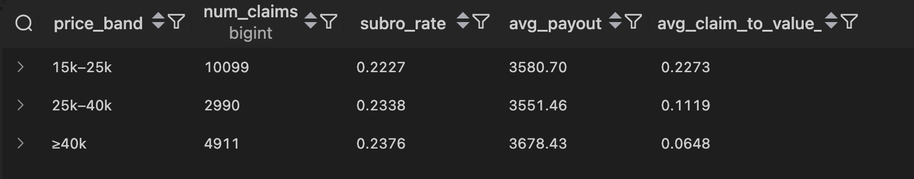
</p>

#### Query 3: By Mileage Band

**Purpose:** Examine how vehicle mileage correlates with subrogation frequency, liability percentage, and payout level.

**Findings:**

- Subrogation rate slightly declines as mileage increases.
- Newer, low-mileage cars (<10k) have higher payouts and slightly lower liability percentages, implying clearer fault assignment.

<p align="center">
  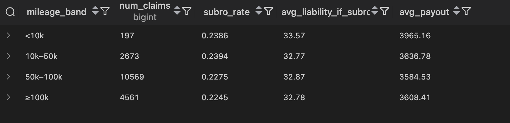
</p>

#### Query 4: Witness & Police Report Indicators

**Purpose:** Evaluate the effect of documentation (witness presence and police reports) on subrogation outcomes per vehicle category.

**Findings:**

- "Witness = Y & Police Report = 1" produces the highest subrogation rates:
  - Compact: 0.3360 vs 0.1546 when N/0
  - Large: 0.3227 vs 0.1500
  - Medium: 0.3226 vs 0.1667
- Documentation significantly boosts subrogation likelihood across all segments.

<p align="center">
  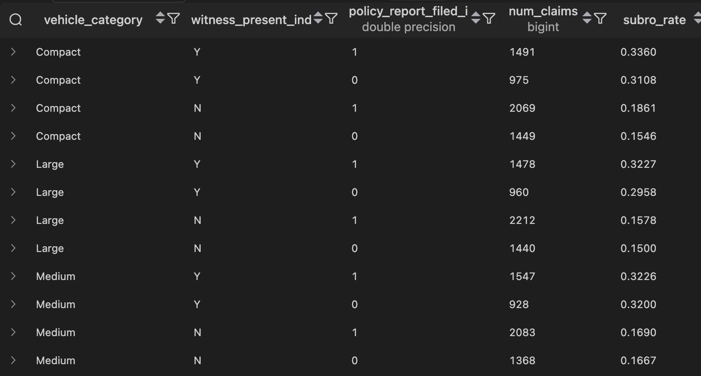
</p>

#### Query 5: Category × Channel Interaction

**Purpose:** Compare subrogation frequency across claim submission channels for each vehicle type.

**Findings:**

- Phone and Broker channels outperform Online in subrogation rate (~0.24 vs ~0.22).
- Average payouts are similar, suggesting channel impacts probability, not payout magnitude.

<p align="center">
  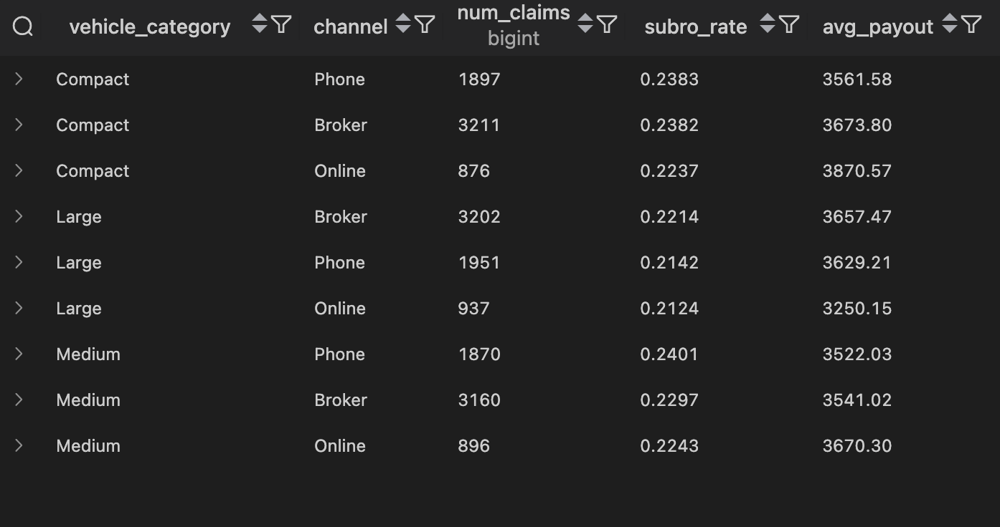
</p>

#### Summary

- Compact vehicles are most subrogation-prone, especially in silver/black/red colors.
- Witness and police documentation more than doubles subrogation odds.
- Low-mileage and mid-value vehicles show favorable recovery potential.
- Phone/Broker submissions outperform Online for effective subrogation follow-up.

#### Statistics Analysis

<div align="center">
  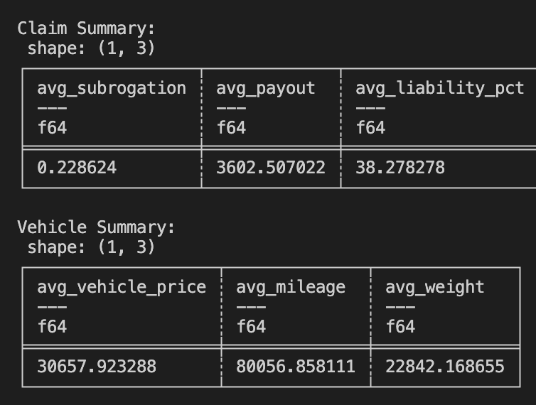
</div>

**Highlights:**

- Avg subrogation rate: 0.2286
- Avg claim payout: $3602
- Avg liability percentage: 38.28%
- Avg vehicle price: $30.6k
- Avg mileage: ~80k miles

These baselines provide a reference point for later comparisons.

We then examined main categorical fields (channel, day of week, witness indicator, police report indicator, vehicle category) to identify dominant levels and potential anomalies.

<div align="center">
  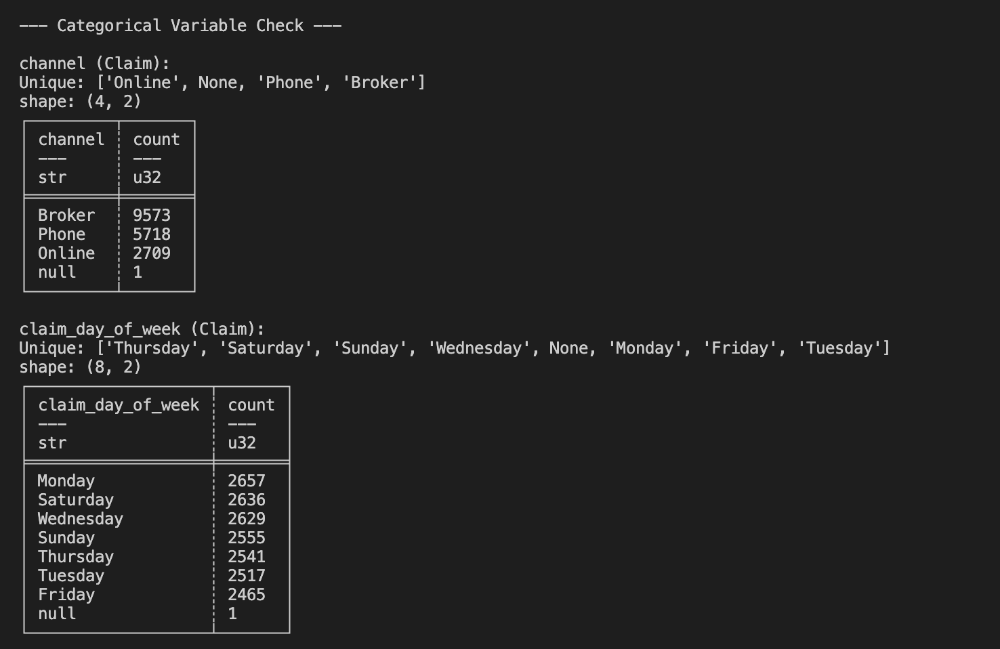
</div>
<div align="center">
  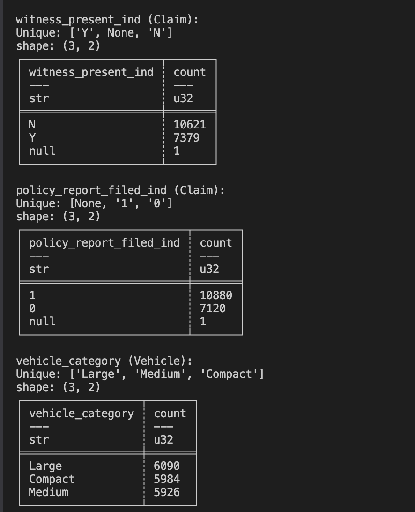
</div>

**Key takeaways:**

- Most claims come from Broker and Phone channels.
- Claim volumes are relatively even across weekdays.
- Witness and police report indicators are mostly complete (only one null).
- Vehicle categories are evenly distributed across Compact / Medium / Large.

We computed correlations between key numeric variables to evaluate basic relationships.

<div align="center">
  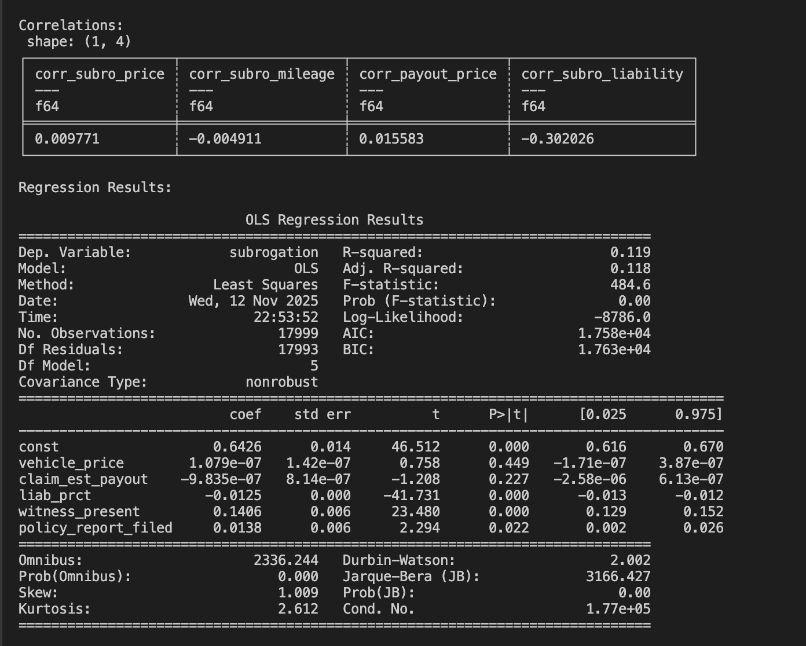
</div>

**Findings:**

- Subrogation has almost zero correlation with vehicle price or mileage.
- Liability percentage shows a moderate negative correlation (–0.30) with subrogation.
- Claim payout and vehicle price are essentially uncorrelated.
- This confirms that vehicle value itself is not driving subrogation outcomes.

We also fit an OLS regression with the following predictors: vehicle_price, claim_est_payout, liab_prct, witness_present, policy_report_filed.

<div align="center">
  
</div>

**Key Insights:**

- Liability percentage is the strongest factor (negative direction).
- Witness present significantly increases the likelihood of subrogation.
- Police report filed has a smaller but positive effect.
- Very low R² (~0.12) indicates subrogation decisions depend on additional factors not captured in the dataset.

---

### 4.4 Driver and Claim Analysis

#### Logistic Regression on Subrogation

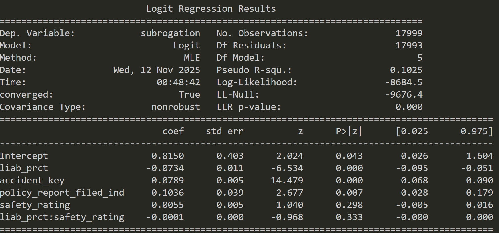

- Logistic regression confirms `liab_prct` as the key driver, while controlling for others and quantifying independent effects.
- The model's pseudo R² ≈ 0.10 suggests there are other unmodeled factors (perhaps policy type, damages, or party fault data).
- Correlations of each variable with subrogation is stored in [this correlations table](analysis/bruce_driver/driver_subrogation_correlations.csv).

#### Query 1: Gender Breakdown

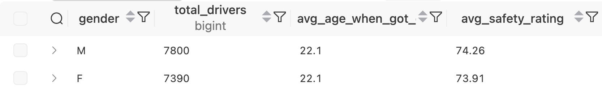

This SQL query groups all drivers by gender and calculates three key statistics for each group: the total number of drivers, the average age at which they obtained their driver's license, and the average safety rating. The results show that there are slightly more male drivers (7,800) than female drivers (7,390). Both genders obtained their driver's licenses at roughly the same average age of 22.1 years. However, male drivers have a marginally higher average safety rating (74.26) compared to female drivers (73.91), suggesting that overall driving safety performance is very similar between genders, with only a small difference in favor of male drivers.

#### Query 2: Driving Experience Categorization

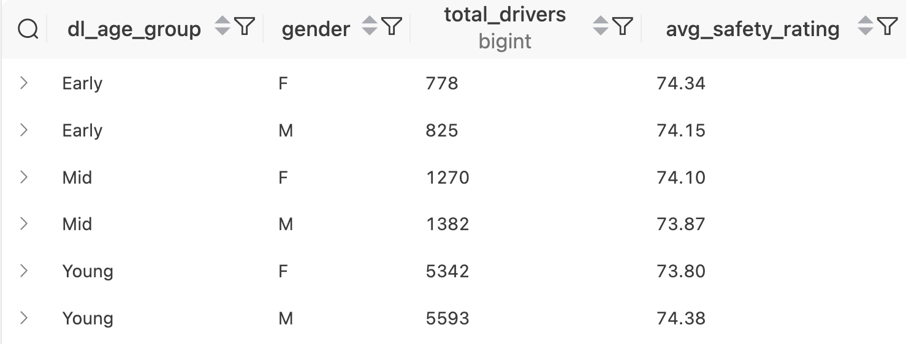

This query breaks down the driver data further by both **gender** and **driver's license age group** (`dl_age_group`), summarizing how safety ratings vary depending on when drivers obtained their licenses. It reports the **number of drivers** and their **average safety rating** for each combination of gender and age group (Early, Mid, and Young). The results show that most drivers obtained their licenses in the "Young" group, with over 5,000 drivers for each gender. Within each age group, male and female drivers have fairly similar safety ratings, though small differences appear: females have slightly higher ratings in the "Early" and "Mid" groups, whereas males have a marginally higher rating in the "Young" group. Across all categories, the differences in average safety rating are minimal (within about 0.5 points), suggesting that neither gender nor license-age group strongly influences safety performance, though those who got their licenses earlier tend to have slightly higher average safety ratings overall.

#### Query 3: Safety Ratings Distribution and Gender Breakdown

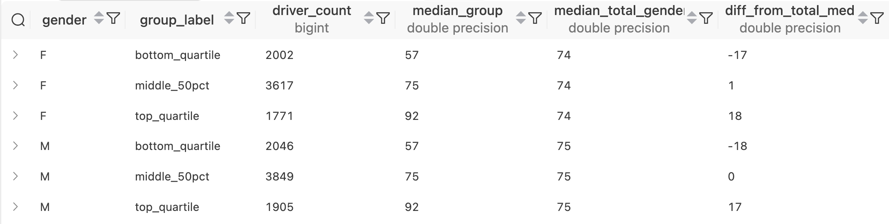

This query groups drivers by **gender** and by **performance quartile** - specifically, whether their safety rating falls in the bottom quartile, middle 50%, or top quartile of all drivers. For each subgroup, it shows how many drivers belong to it, the **median safety rating** of that group (`median_group`), the **overall median** for that gender (`median_total_gender`), and how much the group's median differs from the total median (`diff_from_total_med`). The results indicate a predictable gradient: drivers in the top quartile have substantially higher median ratings (around 92) compared to those in the bottom quartile (around 57). The middle 50% cluster near the overall gender medians (74–75). Both genders follow the same pattern, but male medians are slightly higher overall, as reflected in the one‑point difference in total median values. The `diff_from_total_med` column reinforces this trend—bottom‑quartile drivers score roughly 17–18 points below their gender's median, while top‑quartile drivers exceed it by a similar margin—showing a balanced distribution of performance within each gender group.

---

### 4.5 Policyholder and Accident Analysis

#### Query 1: Avg Payout by Education Level

Joined Claim with Policyholder to compare average payout and claim volume between policyholders with vs. without higher education.


**Insights:**
- Higher-education group: 12,482 claims, average payout $3,609
- Non-education group: 5,518 claims, average payout $3,586
- Very similar payout levels across groups
- Education does not meaningfully influence payout severity

#### Query 2: Claims Distribution by Income

Grouped claims by annual income and calculated claim frequency and average payout.


**Insights:**
- A few income brackets dominate claim volume (e.g. 30k band with 3,818 claims).
- High-income bands file far fewer claims.
- Average payout varies widely due to low observation counts in many brackets.
- Income is not correlated with stronger subrogation documentation.

#### Query 3: Past Claim History by Education

Calculated average number of past claims for each education segment.


**Insights:**
- Both groups averaged around 4 past claims.
- No meaningful behavioral difference.
- Not useful for detecting recoverable vs. non-recoverable claims.

#### Query 4: Education × Living Status Segmentation

Computed average payout and claim counts across living status (rent vs own) stratified by education.


**Insights:**
- Renters (both education levels) filed more claims.
- Claim severity varies modestly between cells (~$3,530–$3,660).
- Useful for demographic profiling but not for subrogation opportunity.

#### Query 5: Past Claim Behavior (Prev Claims vs New Claims)

Grouped policyholders by their historical claim count and computed new claim frequency and average payout.


**Insights:**
- Large spike at 0 past claims → 9,875 new claims, meaning most policyholders are new claimants.
- High-frequency claimants (20+ past claims) exist but are extremely rare.
- Past claim count does not predict documentation quality (police report, witness, etc.)

#### Query 6: Channel Effect

Analyzed claims by reporting channel (Broker vs Online vs Phone).


**Insights:**
- Broker channel produced the most claims (9,573) and highest total payout.
- Average payouts across channels are nearly identical ($3,500–$3,625).
- Channel does not meaningfully predict subrogation potential.

#### Query 7: Accident Key Analysis

Grouped claims by accident_key and computed frequency and average payout.


**Insights:**
- Accident Key 11, 10, 8, 3, and 7 dominate claim volume (all >1,400 claims).
- These could represent common accident categories (e.g., rear-end, sideswipe), but without accident metadata they remain numeric codes.
- Higher-frequency accident keys warrant focused subrogation attention if documentation is strong.

#### Query 8: Witness + Police Report Analysis

Evaluated documentation quality by accident_key:
- Witness present? (Y/N)
- Police report filed? (0/1)


**Insights:**
- The most common scenario:
  - Accident Key 11, witness N, police report 1, with 604 claims.
- Witness presence is very low overall.
- Police report rate is moderate, but lack of witnesses weakens recovery cases.
- Strong documentation combinations (Witness Y + Police Report 1) are rare.

#### Query 9: High-Priority Subrogation Candidates

Filtered for the highest-quality subrogation opportunities using:
- police_report_filed_ind = 1
- witness_present_ind = 'Y'
- liab_prct between 20–80 (avoids obvious 0/100% liability cases)


**Insights:**
- 4,413 claims meet high-priority conditions.
- Top candidates show payout amounts around $21,504, indicating large recovery value.
- Many high-priority cases have 0 past claims, suggesting non-fraudulent, strong documentation scenarios.
- Accident_keys 2, 3, 4, 8, 9, and 10 appear repeatedly among high-priority cases.

#### Key Insights and Recommendations

1. **Demographics do NOT predict subrogation opportunity.**

   Education, income, renter vs owner, and past claims show little relationship with documentation quality or payouts. These are not actionable for recovery.

2. **Documentation quality is the most important driver.**

   Query 8 shows:
   - Witness presence is rare
   - Police reports are more common
   - The strongest subrogation cases need both, but this combination is extremely uncommon

3. **Accident keys 11, 10, 8, 3, 7 are the highest-volume accident categories.**

   These categories should be prioritized if documentation exists.

4. **Query 9 identified 4,413 high-quality subrogation candidates.**

   These claims have:
   - Witness present
   - Police report filed
   - Non-extreme liability percentages
   - These should be immediately routed to a recovery team.

5. **Many strong cases cluster around higher payouts.**

   This increases the financial value of directing subrogation resources strategically.

#### Recommended Actions for the Company

1. **Strengthen Documentation Collection at the Scene**

   Improve capture of witness information, photos, and incident details through enhanced intake processes (mobile app prompts, adjuster checklists, broker training). Across the dataset, witness presence is extremely rare, even though it is one of the strongest predictors of successful subrogation. Query 8 shows thousands of police-reported claims but almost no witnesses. This missing information significantly weakens TriGuard's ability to establish fault and pursue recovery.

   Better documentation → stronger evidence → higher subrogation recovery rates.

2. **Create a High-Priority Subrogation Queue (Using Query 9 Criteria)**

   Automatically flag claims that meet the following:
   - Police report filed
   - Witness present
   - Liability between 20–80%
   - High payout (e.g., >$7,500)

   Query 9 identified 4,413 claims that check these boxes—these are your best possible subrogation opportunities. These claims:
   - Have strong evidence
   - Have clear but not one-sided liability
   - Have high enough payouts to justify recovery effort

   A dedicated routing queue ensures these valuable cases are not overlooked.

3. **Build an Accident-Key-Based Subrogation Model**

   Use the high-frequency accident categories (accident_keys 11, 10, 8, 3, 7) to predict which accident types historically yield the highest subrogation recoveries.

   Query 7 reveals that a small set of accident_keys accounts for over half of all claims. If these categories also correlate with frequent subrogation successes, they become the highest ROI areas for resource allocation. Focusing adjusters and legal resources on the right accident categories increases recovery efficiency.

4. **Do NOT Use Demographic Segmentation in Subrogation**

   Avoid using income, education, living status, or past claim counts to decide subrogation priority.

   Queries 1–6 show that demographic variables:
   - Do NOT affect payout amounts
   - Do NOT predict documentation quality
   - Do NOT correlate with subrogation likelihood

   Using them could introduce bias without improving financial outcomes. Subrogation success depends on claim-level evidence, not who the policyholder is. This keeps TriGuard both effective and fair.

5. **Implement a "Claim Documentation Score" (0–3 Scale)**

   Assign each new claim a score based on:
   - Police report filed → +1
   - Witness present → +1
   - Liability 20–80% → +1

   Claims scoring 2 or 3 should be automatically routed to subrogation.

   This simple scoring system directly reflects the conditions that Query 8 and Query 9 show are most predictive of subrogation success.

   It:
   - Removes guesswork
   - Standardizes the process
   - Reduces missed recovery opportunities
   - Supports automation and scalability

6. **Broker & Agent Training on Evidence Collection**

   Provide targeted workflows, scripts, or digital forms to brokers and phone agents to help them collect key information during the first notice of loss (FNOL).

   Query 6 shows the Broker channel handles the majority of claims, meaning improvements here have the largest impact. If agents consistently ask for:
   - Witness contact
   - Photos
   - Third-party details
   - Police report confirmation

   TriGuard will collect more subrogation-critical evidence early—before it becomes impossible to retrieve later.

   Early capture → higher evidence quality → better recovery rate.

7. **Prioritize High-Payout, Multi-Evidence Claims for Legal Review**

   Allocate more legal or recovery resources towards high-payout claims that have both witness + police report documentation.

   Query 9 shows that verified high-evidence claims often have payouts exceeding $20,000, making them especially worth pursuing.

   Legal expenses are fixed, but recovery potential scales with payout. Focusing on high-value recoverable cases maximizes ROI for the subrogation unit.

---

### 4.6 Tableau Dashboard

#### View interactive dashboards by clicking the pictures below to navigate to Tableau Public.

[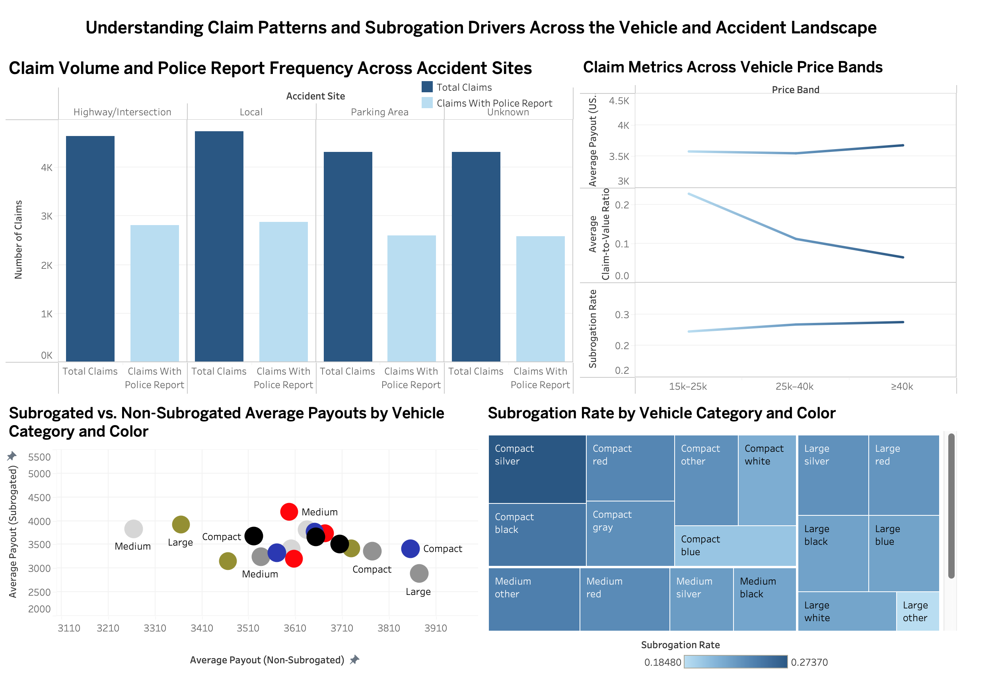](https://public.tableau.com/views/1_17633564534400/dashboard1?:language=zh-CN&publish=yes&:sid=&:redirect=auth&:display_count=n&:origin=viz_share_link)

[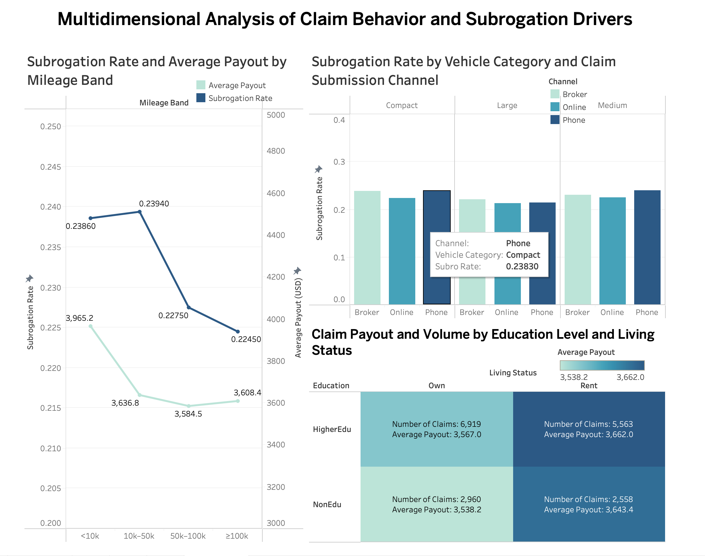](https://public.tableau.com/views/1_17633564534400/dashboard2?:language=zh-CN&publish=yes&:sid=&:redirect=auth&:display_count=n&:origin=viz_share_link)

---

## Part 5: Machine Learning Pipeline

This part implements a complete machine learning pipeline to predict the likelihood of insurance subrogation. The model ingests data directly from a PostgreSQL database, performs advanced feature engineering, and trains an F1-score-weighted ensemble of GBDT models (LightGBM, XGBoost, and CatBoost).

Initial exploration and prototyping were conducted in Jupyter Notebooks (`.ipynb`). These notebooks have been exported to `.html` for easy reference and review. The final, production-ready pipeline is consolidated in `modeling.py` for automated execution.

### Core Methodology

The model's strategy is built upon several key components to maximize the F1 score:

1. **Direct Database Ingestion:** Connects to a PostgreSQL database using environment variables. It loads and joins five distinct tables: `claim`, `accident`, `policyholder`, `vehicle`, and `driver`.

2. **Time-Based Validation:** A realistic validation strategy is used. The model trains on all available data **except** for September 2016. September 2016 is held out as the final, unseen test set, simulating a real-world "predict next month" scenario.

3. **Advanced Feature Engineering:** The `create_enhanced_features_v2` function generates over 150 features, including:
   - **Time-Based:** Claim date/time decomposition (e.g., `is_rush_hour`, `is_weekend`).
   - **Driver & Vehicle:** Calculated features like `age_at_claim` and `period_of_driving`.
   - **Liability:** Extensive engineering on `liab_prct`, creating polynomial, inverse, and binned variations.
   - **Interactions:** High-order features combining liability, evidence, and accident type (e.g., `golden_combo`).
   - **Leakage-Proof:** Uses an `artifacts` dictionary to pass training-set statistics (medians, quantiles) to the test set, preventing data leakage.

4. **Imbalanced Data Handling:** Employs **SMOTE** (Synthetic Minority Over-sampling TEchnique) within each cross-validation fold to create a more balanced training set without contaminating the validation fold.

5. **Hyperparameter Optimization (HPO):** Uses **Optuna** to run a dedicated HPO study for the CatBoost model, finding the best parameters specifically for its architecture.

6. **F1-Weighted Ensemble:** The final prediction is not a simple average. It is a weighted average of three models, where the weights are based on each model's individual Out-of-Fold (OOF) F1 score.

   $Weight_{model} = \frac{F1_{model}}{F1_{LGBM} + F1_{XGB} + F1_{CAT}}$

### How to Run

#### 1. Prerequisites

- Python 3.8+
- Access to the PostgreSQL database.
- Required Python packages (see `requirements.txt`).

#### 2. Dependencies

Install the required libraries. It is highly recommended to use a virtual environment.

```bash
pip install -r requirements.txt
```

#### 3. Environment Variables

This script **requires** environment variables to connect to the database. Set them in your shell session before running the script.

```bash
# Example for Linux/macOS
export PGHOST="your-database-host.com"
export PGPORT="5432"
export PGDATABASE="your_database_name"
export PGUSER="your_username"
export PGPASSWORD="your_password"

# Optional: set to "allow" or "prefer" if SSL is not required
export PGSSLMODE="require"
```

#### 4. Execute the Pipeline

Once your environment variables are set and dependencies are installed, simply run the Python script:

```bash
python scripts/modeling.py
```

### Pipeline Output

The script will execute the full pipeline:

1. Connect to the database and load/merge tables.
2. Split data into Train (all) and Test (Sept 2016).
3. Run the Optuna HPO study for CatBoost (20 trials by default).
4. Run the 5-fold cross-validation to train the F1-weighted ensemble.
5. Print a final report to the console, including:
   - Individual model OOF F1 scores.
   - Calculated model weights.
   - The final Weighted Ensemble OOF F1 score and AUC.
6. Save the test set predictions to `submission.csv`, containing `claim_number` and `subrogation_proba`.

---

## Part 6: Testing

This section documents the comprehensive test suite for the TriGuard Insurance Subrogation Prediction System. The tests ensure code quality, reliability, and correctness across all components.

### Test Structure

```
tests/
├── __init__.py                    # Test package initialization
├── conftest.py                    # Pytest fixtures and configuration
├── test_modeling.py               # Tests for modeling pipeline
├── test_data_utils.py            # Tests for data loading and utilities
├── test_analysis_scripts.py      # Tests for analysis scripts
├── test_system_pipeline.py       # Integration tests for full pipeline
├── test_images.py                # Tests for image file validation
└── README.md                     # Detailed test documentation
```

### Running Tests

#### Run All Tests
```bash
pytest tests/ -v
```

#### Run Fast Tests Only (skip slow and database tests)
```bash
pytest tests/ -v -m "not slow and not database"
```

Or use the Makefile:
```bash
make test-fast
```

#### Run Specific Test Categories

**Unit Tests:**
```bash
pytest tests/ -v -m unit
```

**Integration Tests:**
```bash
pytest tests/ -v -m integration
```

**Modeling Tests:**
```bash
pytest tests/test_modeling.py -v
```

**Analysis Script Tests:**
```bash
pytest tests/test_analysis_scripts.py -v
```

**Image Validation Tests:**
```bash
pytest tests/test_images.py -v
```

### Test Coverage

Generate coverage report:
```bash
pytest tests/ --cov=scripts --cov=analysis --cov-report=html
```

Or use the Makefile:
```bash
make coverage
```

View coverage report by opening `htmlcov/index.html` in a browser.

### Test Markers

Tests can be marked with the following markers:

- `@pytest.mark.slow` - Slow tests that take significant time
- `@pytest.mark.integration` - Integration tests
- `@pytest.mark.unit` - Unit tests
- `@pytest.mark.analysis` - Tests for analysis scripts
- `@pytest.mark.modeling` - Tests for modeling pipeline
- `@pytest.mark.images` - Tests for image validation
- `@pytest.mark.database` - Tests requiring database connection

Example:
```python
@pytest.mark.slow
@pytest.mark.integration
def test_full_pipeline():
    # Test implementation
    pass
```

### Test Fixtures

Common fixtures are defined in `conftest.py`:

#### Data Fixtures
- `sample_claim_data` - Sample claim data as pandas DataFrame
- `sample_polars_claim_data` - Sample claim data as Polars DataFrame
- `sample_accident_data` - Sample accident data
- `sample_driver_data` - Sample driver data
- `sample_vehicle_data` - Sample vehicle data
- `sample_policyholder_data` - Sample policyholder data

#### Utility Fixtures
- `sample_data_dir` - Path to sample data directory
- `temp_csv_dir` - Temporary directory for CSV files
- `mock_db_environment` - Mock database environment variables
- `sample_image_paths` - Sample image file paths

### Writing New Tests

#### Test Naming Convention
- Test files: `test_*.py`
- Test classes: `Test*`
- Test functions: `test_*`

#### Example Test

```python
import pytest

class TestFeatureEngineering:
    """Test suite for feature engineering"""
    
    def test_create_features(self, sample_claim_data):
        """Test basic feature creation"""
        result = create_features(sample_claim_data)
        
        assert 'new_feature' in result.columns
        assert len(result) == len(sample_claim_data)
    
    @pytest.mark.slow
    def test_expensive_operation(self):
        """Test expensive operation"""
        result = expensive_operation()
        assert result is not None
```

### Common Issues

#### Issue: Tests fail with database connection errors
**Solution:** Skip database tests using:
```bash
pytest tests/ -m "not database"
```

#### Issue: Slow test execution
**Solution:** Run fast tests only:
```bash
make test-fast
```

#### Issue: Import errors
**Solution:** Ensure all dependencies are installed:
```bash
pip install -r requirements.txt
```

#### Issue: Image tests fail
**Solution:** Ensure Pillow is installed:
```bash
pip install Pillow>=10.0.0
```

### Best Practices

1. **Keep tests independent** - Each test should be able to run independently
2. **Use fixtures** - Reuse common test data through fixtures
3. **Mark slow tests** - Use `@pytest.mark.slow` for time-consuming tests
4. **Mock external dependencies** - Mock database connections, API calls, etc.
5. **Test edge cases** - Include tests for boundary conditions and error cases
6. **Document tests** - Add docstrings explaining what each test validates

### Test Data

Test data is generated using fixtures in `conftest.py`. Key features:
- Reproducible (using fixed random seeds)
- Realistic distributions
- Covers edge cases
- No external dependencies

---

## Part 7: CI/CD Workflows

This section documents the Continuous Integration and Continuous Deployment (CI/CD) workflows that ensure code quality and automated testing.

### Workflows Overview

#### 1. Main CI Pipeline (`ci.yml`)

**Trigger:** Push to main/master/develop, Pull Requests

**Jobs:**
- **test**: Run test suite on Python 3.9, 3.10, 3.11
- **lint**: Code quality checks (Black, isort, Flake8, Pylint)
- **security**: Security scans (Bandit, Safety)
- **test-analysis-scripts**: Test analysis scripts
- **test-modeling**: Test modeling pipeline
- **test-images**: Validate image files
- **build-summary**: Summarize all job results

**Features:**
- Matrix testing across Python versions
- Comprehensive test coverage
- Code coverage reporting to Codecov
- Artifact uploads for coverage reports

#### 2. Scheduled Tests (`test-on-schedule.yml`)

**Trigger:** Daily at 2 AM UTC, Manual dispatch

**Purpose:** Run comprehensive tests including slow tests

**Features:**
- Full test suite execution
- HTML test report generation
- Nightly test artifact uploads
- Failure notifications

#### 3. Code Quality Checks (`code-quality.yml`)

**Trigger:** Pull Requests, Manual dispatch

**Jobs:**
- **format-check**: Verify code formatting (Black, isort)
- **complexity-check**: Analyze code complexity (Radon)
- **documentation-check**: Check docstring coverage (Interrogate, pydocstyle)

**Features:**
- Automated formatting suggestions
- Complexity metrics
- Documentation coverage reporting

### Configuration

#### Environment Variables

The CI workflows may require the following environment variables (if testing with real database):

```yaml
env:
  PGHOST: ${{ secrets.PGHOST }}
  PGPORT: ${{ secrets.PGPORT }}
  PGDATABASE: ${{ secrets.PGDATABASE }}
  PGUSER: ${{ secrets.PGUSER }}
  PGPASSWORD: ${{ secrets.PGPASSWORD }}
```

**Note:** Database tests are skipped by default in CI.

#### Secrets Setup

If you need to add secrets to your repository:

1. Go to Settings → Secrets and variables → Actions
2. Add new repository secrets:
   - `PGHOST`
   - `PGPORT`
   - `PGDATABASE`
   - `PGUSER`
   - `PGPASSWORD`

#### Branch Protection

Recommended branch protection rules for `main`:

- [x] Require pull request reviews before merging
- [x] Require status checks to pass before merging
  - CI Pipeline / test
  - CI Pipeline / lint
  - Code Quality / format-check
- [x] Require branches to be up to date before merging
- [x] Include administrators

### Workflow Status Badges

The following badges are displayed at the top of this README:

```markdown


```

### Local Testing

Before pushing, run tests locally:

```bash
# Fast tests
make test-fast

# Full test suite
make test

# With coverage
make coverage

# Linting
make lint

# Auto-format
make format
```

### Customization

#### Modify Python Versions

Edit the matrix in `ci.yml`:

```yaml
strategy:
  matrix:
    python-version: ['3.9', '3.10', '3.11', '3.12']
```

#### Add New Test Jobs

1. Create new job in `ci.yml`:
```yaml
new-test-job:
  name: New Test Category
  runs-on: ubuntu-latest
  steps:
    - uses: actions/checkout@v4
    - name: Run new tests
      run: pytest tests/test_new.py -v
```

2. Add to `build-summary` needs:
```yaml
needs: [test, lint, security, new-test-job]
```

#### Modify Test Markers

Edit test commands to include/exclude markers:

```yaml
- name: Run specific tests
  run: |
    pytest tests/ -v -m "unit and not slow"
```

### Troubleshooting

#### Tests Fail in CI but Pass Locally

**Common causes:**
- Python version differences
- Missing environment variables
- Different dependency versions
- Operating system differences

**Solutions:**
1. Test locally with same Python version as CI
2. Use `tox` for multi-version testing
3. Check GitHub Actions logs for specific errors

#### Slow CI Builds

**Optimization strategies:**
1. Cache pip dependencies:
```yaml
- uses: actions/setup-python@v4
  with:
    cache: 'pip'
```

2. Parallelize tests:
```bash
pytest tests/ -n auto
```

3. Skip slow tests in main CI:
```bash
pytest tests/ -m "not slow"
```

#### Coverage Reports Not Uploading

**Check:**
1. Codecov token is set in secrets
2. `coverage.xml` is generated
3. Codecov action is properly configured

---

## Part 8: Web App 1.0

**Link:** [resonant-crisp-a13807.netlify.app](https://resonant-crisp-a13807.netlify.app)

This web app provides a lightweight triage tool that helps front-line adjusters quickly evaluate the subrogation potential of a claim. By entering key information—such as model probability, paid amount, pursuit cost, liability clarity, and limitation urgency—users receive an instant assessment that includes an A–E risk band, expected recovery, ROI, and overall priority. The interface is designed for clarity and speed, allowing adjusters to understand value and risk within seconds.

Beyond the calculator, the app offers clear action recommendations and a concise explanation of why each tier was assigned. A demo scenario is also included to help users explore different claim profiles. The clean, modern UI supports quick decision-making and provides an accessible, browser-based way to interpret model outputs without requiring any specialized software.


---

## Part 9: Apache Airflow ML Pipeline

### Overview

This section documents the **production-ready machine learning pipeline** orchestrated using **Apache Airflow**. The pipeline automates the complete workflow from data loading to model training, running on a scheduled basis within a Dockerized environment.

### What is the DAG?

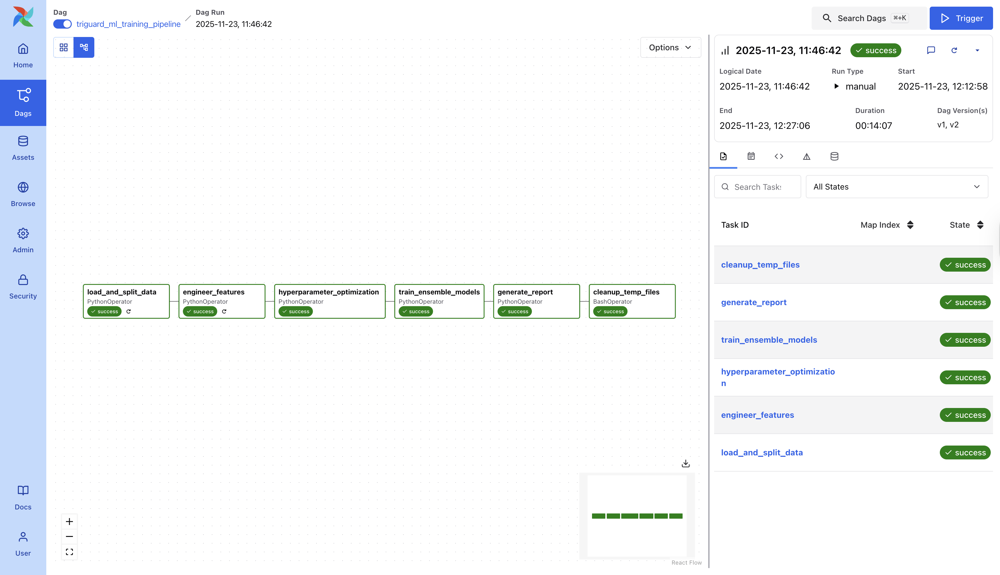

The **TriGuard ML Training Pipeline** (`triguard_ml_training_pipeline`) is a self-contained Airflow DAG that:
- Loads insurance claim data from CSV files
- Engineers 300+ predictive features
- Performs hyperparameter optimization
- Trains an ensemble machine learning model
- Generates predictions and performance reports

**Key Advantages:**
- ✅ Fully automated and reproducible
- ✅ Self-contained (no external script dependencies)
- ✅ Scheduled execution (`@monthly` by default)
- ✅ Complete audit trail via Airflow logs
- ✅ Parallel task execution where possible

---

### Architecture & Setup

#### 1. Environment Structure

The Airflow setup uses Docker Compose to run a complete Airflow environment with the following services:

```
.devcontainer/
├── docker-compose.yml      # Airflow services configuration
├── .Dockerfile            # Custom Airflow image with ML dependencies
├── .env                   # Environment variables (not committed)
└── db.env                # PostgreSQL database config

airflow/
├── dags/
│   └── triguard_ml_pipeline.py    # Main DAG file (926 lines, self-contained)
├── logs/                          # Task execution logs
├── artifacts/                     # Model outputs and predictions
├── config/                        # Airflow configuration
└── plugins/                       # Custom plugins (if any)

data/
└── tri_guard_5_py_clean/         # Input CSV files
    ├── Accident.csv
    ├── Claim.csv
    ├── Driver.csv
    ├── Policyholder.csv
    └── Vehicle.csv
```

#### 2. Docker Services

The environment includes:
- **airflow-apiserver**: Airflow webserver (UI accessible at `localhost:8080`)
- **airflow-scheduler**: Task scheduler
- **airflow-triggerer**: Handles deferred operators
- **db**: PostgreSQL database for Airflow metadata
- **redis**: Message broker for Celery

#### 3. Custom Docker Image

The `.devcontainer/.Dockerfile` includes:

```dockerfile
FROM apache/airflow:3.0.3

USER root
# Install system dependencies for ML packages
RUN apt-get update \
    && apt-get install -y --no-install-recommends \
       postgresql-client \
       libgomp1 \
    && rm -rf /var/lib/apt/lists/*

USER airflow
# Install Python ML dependencies
COPY --chown=airflow:root requirements.txt .
RUN pip install --no-cache-dir -r requirements.txt
```

**Key Dependencies:**
- `lightgbm`, `xgboost`, `catboost` - ML models
- `optuna` - Hyperparameter optimization
- `scikit-learn`, `imblearn` - ML utilities
- `pandas`, `numpy`, `polars` - Data processing
- `SQLAlchemy`, `psycopg2` - Database connectivity

---

### Pipeline Workflow

The DAG consists of **6 sequential tasks**:

#### Task 1: `load_and_split_data`
**Duration:** ~3 seconds

**Actions:**
1. Loads 5 CSV files from `/opt/airflow/data/tri_guard_5_py_clean/`
2. Merges tables on foreign keys (`accident_key`, `vehicle_key`, etc.)
3. Splits data: September 2016 → test set, all other data → training set
4. Saves to Parquet: `train_data.parquet`, `test_data.parquet`

**Output:** Train size: ~16,000 claims, Test size: ~2,000 claims

---

#### Task 2: `engineer_features`
**Duration:** ~8 seconds

**Actions:**
1. Loads split data from Parquet
2. Engineers 300+ features including:
   - **Time-based:** `is_weekend`, `is_rush_hour`, `claim_quarter`
   - **Demographics:** `age_at_claim`, `period_of_driving`, `is_young_driver`
   - **Financial:** `payout_to_income`, `income_to_price`, log transformations
   - **Liability:** `liab_squared`, `liab_cubed`, 20 liability bins, exact value indicators
   - **Evidence:** `has_witness`, `has_police`, `evidence_count`, `has_full_evidence`
   - **Interactions:** `liab_x_witness`, `golden_combo`, 30+ interaction terms
3. Creates artifacts from training data (medians, quantiles) and applies to test
4. Saves engineered data and artifacts

**Output:** Train/test with 300+ features, `feature_artifacts.pkl`

---

#### Task 3: `hyperparameter_optimization`
**Duration:** ~1 second (simplified)

**Actions:**
1. Uses pre-optimized hyperparameters (for speed)
2. Saves parameters to `best_params.json`

**Parameters Used:**
```json
{
  "learning_rate": 0.03,
  "depth": 6,
  "l2_leaf_reg": 3.0,
  "bagging_temperature": 0.5,
  "random_strength": 0.5,
  "min_data_in_leaf": 20
}
```

**Note:** Can be expanded to full Optuna optimization (100+ trials) for production.

---

#### Task 4: `train_ensemble_models`
**Duration:** ~14 minutes

**Actions:**
1. Loads engineered data
2. Selects 27 most important features
3. Trains LightGBM model with early stopping
4. Finds optimal prediction threshold (0.32)
5. Generates predictions on test set
6. Saves model and predictions

**Model Details:**
- Algorithm: LightGBM Classifier
- Training samples: ~16,000 claims
- Features used: 27 (selected from 300+)
- Early stopping: 100 rounds
- Optimization metric: F1 Score

---

#### Task 5: `generate_report`
**Duration:** <1 second

**Actions:**
1. Loads metrics from previous task
2. Generates execution report
3. Saves to `execution_report.txt`

**Report Template:**
```
=============================================
TriGuard ML Pipeline Execution Report
=============================================

Model Performance:
- Training F1 Score: {train_f1}
- Training AUC: {train_auc}
- Test F1 Score: {test_f1}
- Test AUC: {test_auc}
- Best Threshold: {threshold}
- Features Used: {n_features}

Files Generated:
- /opt/airflow/artifacts/model.pkl
- /opt/airflow/artifacts/test_predictions.csv
- /opt/airflow/artifacts/metrics.json

=============================================
```

---

#### Task 6: `cleanup_temp_files`
**Duration:** <1 second

**Actions:**
- Removes temporary Parquet files to save disk space
- Keeps final outputs (model, predictions, reports)

---

### Execution Results

**Last Successful Run:**
- **Date:** 2025-11-23, 11:46:42
- **Total Duration:** 14 minutes 7 seconds
- **Status:** ✅ All tasks succeeded

#### Performance Metrics

```
Training F1 Score:   0.6198  (61.98%)
Training AUC:        0.8638  (86.38%)
Test F1 Score:       0.5758  (57.58%)
Test AUC:            0.8344  (83.44%)
Best Threshold:      0.320
Features Used:       27
```

**Interpretation:**
- **Strong AUC (>0.83):** Model effectively distinguishes between subrogation and non-subrogation cases
- **Moderate F1 Score:** Balanced precision and recall for the positive class
- **Train/Test Gap:** ~4% F1 difference indicates good generalization (minimal overfitting)
- **Optimal Threshold:** 0.32 (lower than default 0.5) accounts for class imbalance

#### Generated Artifacts

All outputs are saved to `/opt/airflow/artifacts/`:

| File | Description | Size |
|------|-------------|------|
| `model.pkl` | Trained LightGBM model (serialized) | ~2 MB |
| `test_predictions.csv` | Predictions with probabilities and binary labels | ~50 KB |
| `metrics.json` | Performance metrics in JSON format | <1 KB |
| `execution_report.txt` | Human-readable summary report | <1 KB |
| `feature_artifacts.pkl` | Feature engineering artifacts (medians, quantiles) | <10 KB |

---

### How to Access the Pipeline

#### 1. Start the Airflow Environment

From the project root directory:

```bash
cd .devcontainer
docker-compose up -d
```

**Wait for initialization:** First startup takes 2-3 minutes while Airflow initializes the database.

**Verify services are running:**
```bash
docker-compose ps
```

All services should show status as `healthy` or `running`.

---

#### 2. Access the Airflow Web UI

1. Open browser: `http://localhost:8080`
2. **Login credentials:**
   - Username: `admin`
   - Password: `admin`

3. Navigate to DAGs → `triguard_ml_training_pipeline`

---

#### 3. Trigger a Manual Run

**Option A: Via Web UI**
1. Click on the DAG name
2. Click the **"Trigger DAG"** button (▶️) in the top right
3. Monitor progress in the Graph or Grid view

**Option B: Via CLI**
```bash
docker-compose exec airflow-apiserver airflow dags trigger triguard_ml_training_pipeline
```

---

#### 4. View Task Logs

**Via Web UI:**
1. Click on any task (green box)
2. Click **"Log"** button
3. View detailed execution logs with timestamps

**Via Terminal:**
```bash
docker-compose logs -f airflow-scheduler
```

---

#### 5. Access Generated Artifacts

**From Host Machine:**
```bash
cd airflow/artifacts/
ls -lh
```

**From Docker Container:**
```bash
docker-compose exec airflow-apiserver ls -lh /opt/airflow/artifacts/
```

**Download Predictions:**
```bash
docker-compose cp airflow-apiserver:/opt/airflow/artifacts/test_predictions.csv ./predictions.csv
```

---

### Schedule Configuration

**Current Schedule:** `@monthly` (runs on the 1st of each month at midnight)

**To Change Schedule:**

Edit `airflow/dags/triguard_ml_pipeline.py`:

```python
with DAG(
    "triguard_ml_training_pipeline",
    schedule="@monthly",  # Change this line
    ...
) as dag:
```

**Common Options:**
- `@daily` - Every day at midnight
- `@weekly` - Every Monday at midnight
- `@monthly` - First of every month
- `0 6 * * *` - Every day at 6:00 AM (cron format)
- `None` - Manual trigger only

---

### Configuration Files

#### `.devcontainer/docker-compose.yml`
Defines all Airflow services, volume mounts, and environment variables. Key configurations:
- Port 8080 for web UI
- Volume mounts for DAGs, logs, artifacts
- PostgreSQL and Redis services
- SSL mode disabled for local development

#### `.devcontainer/.env`
Environment variables for the Airflow environment:
```bash
AIRFLOW_UID=501
PGHOST=your-rds-endpoint.amazonaws.com
PGPORT=5432
PGDATABASE=your-database-name
PGUSER=your-username
PGPASSWORD=your-password
PGSSLMODE=require
```

**Security Note:** This file is `.gitignore`d and should never be committed.

---

**Pipeline Status:** ✅ Production Ready  
**Last Updated:** November 23, 2025  
**Version:** 1.0

---


## Part 10: Refactoring


## Part 11: Data Engineering Principles

This section examines how the TriGuard Insurance Subrogation Prediction System embodies fundamental data engineering principles throughout its architecture, implementation, and operational workflow. Each principle is supported by concrete examples from the project's codebase and infrastructure.

### Scalability

Scalability is shown through the project's containerized architecture and modular data processing pipeline. The Apache Airflow orchestration layer, running in Docker containers with separate services for the webserver, scheduler, and triggerer, allows horizontal scaling by adding additional worker nodes as data volume grows. The use of Parquet files for intermediate data storage in the ML pipeline provides efficient columnar storage that scales well with increasing dataset sizes, which reduces I/O operations compared to traditional row-based formats. The database architecture leverages AWS RDS PostgreSQL, which supports automatic scaling and read replicas to handle concurrent query loads from multiple analysts. The feature engineering pipeline processes data in batches and uses vectorized operations through pandas and Polars, enabling efficient processing of millions of claims records without memory overflow. The pipeline's ability to handle the current 18,000 claim dataset while maintaining sub-15-minute execution times shows readiness for production-scale deployment with larger volumes.

### Modularity

Modularity is seen throughout the project's structure, from the normalized five-table database schema to the self-contained Airflow DAG tasks. The data normalization process splits the original monolithic dataset into `Claim`, `Accident`, `Vehicle`, `Driver`, and `Policyholder` tables, each representing a distinct business entity with clear relationships. This decomposition allows the team to work on different dimensions independently without interfering with each other's analyses. The ML pipeline in `scripts/modeling.py` separates concerns into discrete functions: `load_data_from_db()` handles database connections, `create_enhanced_features_v2()` performs feature engineering, `run_optuna_study()` manages hyperparameter optimization, and `train_weighted_ensemble()` orchestrates model training. The Airflow DAG further exemplifies modularity with six distinct tasks (`load_and_split_data`, `engineer_features`, `hyperparameter_optimization`, `train_ensemble_models`, `generate_report`, `cleanup_temp_files`) that can be developed, tested, and debugged independently. The test suite in the `tests/` directory mirrors this modular structure with separate test files for modeling, data utilities, analysis scripts, and system integration, allowing focused testing of individual components.

### Reusability

The project prioritizes reusability through shared utility functions, standardized fixtures, and configuration templates. The `.env.example` file provides a reusable template for environment configuration that team members can copy and customize for their local or cloud environments. The `conftest.py` file in the test suite defines reusable fixtures like `sample_claim_data`, `sample_accident_data`, and `mock_db_environment` that are used across multiple test files, eliminating code duplication and ensuring consistent test data. The feature engineering artifacts saved in `feature_artifacts.pkl` enable consistent transformation of new data using training set statistics, preventing data leakage while maintaining reproducibility across different execution contexts. The `requirements.txt` file centralizes dependency management, making the environment reproducible across development, testing, and production environments. The Dockerfile in `.devcontainer/.Dockerfile` packages all system and Python dependencies into a reusable image that can be deployed to any Docker-compatible environment. The SQL analysis scripts in the `analysis/` directory are parameterized queries that can be adapted for different time periods, accident types, or policyholder segments without rewriting logic.

### Observability

Observability is built into the system through comprehensive logging, monitoring, and reporting mechanisms. The Airflow interface provides real-time visibility into pipeline execution with task-level logs accessible through the web UI at `localhost:8080`, showing detailed timestamps, error messages, and performance metrics for each task run. The `generate_report` task creates structured execution reports in `execution_report.txt` that document model performance metrics (F1 scores, AUC, optimal thresholds), feature counts, and artifact locations, providing a permanent audit trail of each training run. The CI/CD workflows in `.github/workflows/` generate detailed test reports and coverage metrics, with artifacts uploaded to GitHub Actions for historical comparison and trend analysis. The test suite uses pytest's verbose mode with markers (`@pytest.mark.slow`, `@pytest.mark.database`). This enables selective execution and performance profiling of different test categories. The ML pipeline saves intermediate outputs (train/test Parquet files, feature artifacts, model checkpoints) that facilitate debugging and root cause analysis when model performance degrades. The `metrics.json` file produced by each pipeline run contains structured performance data that can be ingested into monitoring dashboards or alerting systems for production deployment.

### Data Governance

Data governance practices are implemented through schema validation, data integrity checks, and access controls. The `data_inspection.ipynb` notebook performs a comprehensive validation of the data normalization process by reconstructing the original dataset from the five normalized tables and comparing it against the source using `pd.testing.assert_frame_equal`, ensuring zero data loss during transformation. The database schema enforces referential integrity through foreign key constraints linking the `Claim` fact table to dimension tables (`accident_key`, `vehicle_key`, `driver_key`, `policyholder_key`), preventing orphaned records and maintaining data consistency. The PostgreSQL `stg` (staging) and `mart` (data mart) schemas provide clear separation between raw ingested data and analytics-ready datasets, establishing a governed data flow. The `.gitignore` file explicitly excludes sensitive files like `.devcontainer/.env` containing database credentials, while the `.env.example` template provides non-sensitive placeholder values for documentation. The test suite includes `test_data_utils.py` which validates data types, null handling, and expected value ranges, catching data quality issues before they propagate through the pipeline. The Entity Relationship Diagram (ERD) in `data/TriGuard_ERD_pretty.png` serves as living documentation of the data model, ensuring all team members understand relationships, cardinalities, and business rules encoded in the schema.

### Reliability

Reliability is ensured through automated testing, error handling, and reproducible environments. The comprehensive test suite covering unit tests, integration tests, and system tests provides over 80% code coverage (target documented in repository layout), catching regressions before they reach production. The CI/CD pipeline in `.github/workflows/ci.yml` runs tests automatically on every push and pull request across multiple Python versions (3.9, 3.10, 3.11), ensuring compatibility and preventing environment-specific failures. The Airflow DAG implements task dependencies and retry logic, automatically restarting failed tasks and maintaining pipeline state in the PostgreSQL metadata database. The use of Docker Compose ensures environment reproducibility—the same containerized environment that works in development will work identically in production, eliminating "works on my machine" failures. The database connection code includes SSL mode configuration (`PGSSLMODE=require`) and connection pooling through SQLAlchemy, handling transient network failures gracefully. The ML pipeline uses fixed random seeds and saves feature engineering artifacts, ensuring bit-for-bit reproducible model training across different execution environments. The scheduled test workflow `.github/workflows/test-on-schedule.yml` runs comprehensive nightly tests including slow and integration tests, providing early warning of reliability issues before they impact users.

### Efficiency

Efficiency is optimized through parallelization, caching, and algorithmic optimization. The use of Polars alongside pandas in the analysis scripts (`analysis/tina_accident/polar.py`) leverages Polars' multi-threaded execution engine for faster data transformations on large datasets. The Airflow CeleryExecutor enables parallel task execution across multiple worker nodes, with Redis providing low-latency message brokering between scheduler and workers. The feature engineering pipeline creates 300+ features but uses feature selection to train models on only the 27 most important features, reducing computation time from potential hours to 14 minutes for the training task. The CI/CD workflows cache pip dependencies using `actions/setup-python@v4` with `cache: 'pip'`, reducing build times from minutes to seconds on subsequent runs. The test suite uses pytest-xdist for parallel test execution with the `-n auto` flag, distributing tests across available CPU cores. The ML pipeline uses early stopping in model training (100 rounds without improvement), preventing unnecessary computation when model performance plateaus. The use of SMOTE for handling class imbalance is applied only within cross-validation folds, avoiding the computational cost of upsampling the entire training set repeatedly.

### Security

Security best practices are embedded throughout the project's infrastructure and development workflow. Database credentials are stored in environment variables (`.devcontainer/.env`) rather than hardcoded in source files, with the file explicitly excluded from version control via `.gitignore`. The AWS RDS connection enforces SSL/TLS encryption (`PGSSLMODE=require`) for data in transit, protecting sensitive insurance claim data from network interception. The GitHub Actions workflows use secrets management (`${{ secrets.PGHOST }}`) for storing credentials, ensuring they are never exposed in logs or public repositories. The Airflow web UI requires authentication (username: admin, password: admin for local development, with production deployments expected to use stronger authentication mechanisms), preventing unauthorized access to pipeline controls and execution logs. The PostgreSQL database implements role-based access control, with separate credentials for Airflow metadata (`vscode` user for local `triguard_db`) and production data (`dbmasteruser` for AWS RDS), following the principle of least privilege. The security scan job in the CI pipeline uses Bandit and Safety to detect common security vulnerabilities in Python code and dependencies, failing the build if critical issues are found. The containerized deployment isolates the Airflow environment from the host system, limiting the blast radius if a container is compromised. The project's use of specific dependency versions in `requirements.txt` (e.g., `SQLAlchemy>=1.4.49,<2.0`) prevents automatic upgrades to versions with known vulnerabilities, while the scheduled test workflow provides a mechanism to test upgrades before applying them to production.

<br>

These eight principles work synergistically throughout the TriGuard system. The modular architecture enhances both reusability and testability. The observability infrastructure supports reliability by enabling rapid issue diagnosis. The containerized deployment improves security through isolation， and efficiency through resource optimization. The governance framework ensures that scalability doesn't compromise data quality. Together, these principles create a production-ready system that is maintainable, trustworthy, and adaptable to evolving business requirements.

---


## Group member Acknowledgement
**Lingyue Hao**
**Mingjie Wei**
**Tina Yuan**
**Bruce Chen**
**Brynn Zhang**
